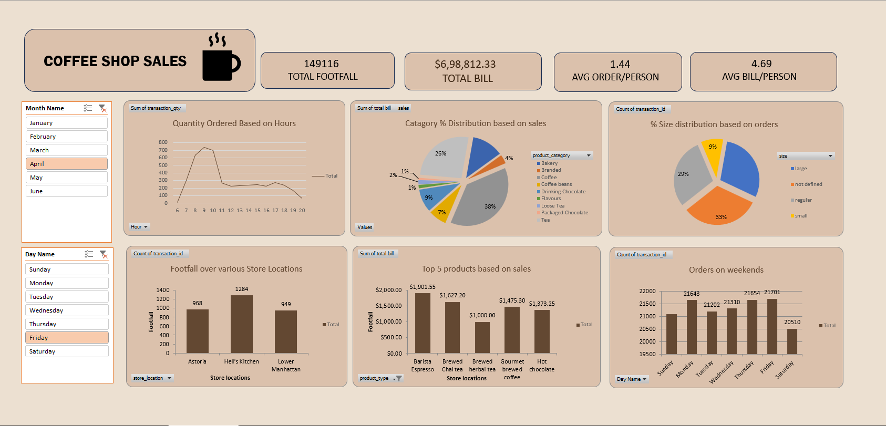

# coffee-shop-sales
# Sales Analysis Dashboard 📊

##  Project Overview

This project presents a Sales Analysis Dashboard created using a dataset sourced from Kaggle. The dashboard helps analyze revenue trends, product performance, and customer ordering behavior across different occasions, cities, and time periods.

The objective of this project is to practice data analysis and build an interactive dashboard that provides meaningful business insights.

---
##  Key Features

* **Total Orders:** 11
* **Total Revenue:** ₹34,078.00
* **Average Customer Spending:** ₹3,098.00
* **Average Order to Delivery Time:** 5.27 days

---

##  Dashboard Insights

### Revenue by Occasion
Sales performance across different occasions such as:

* Anniversary
* Birthday
* Diwali
* Holi
* Raksha Bandhan
* Valentine's Day

This helps identify which occasions generate the most revenue.

---

###  Revenue by Category
Sales are analyzed across different product categories including:

* Cake
* Colors
* Mugs
* Plants
* Raksha Bandhan items
* Soft Toys
* Sweets

This allows identification of the most profitable product categories.

---

### Top 5 Products by Revenue
The dashboard highlights the highest revenue-generating products to understand customer preferences and top sellers.

---

###  Monthly Revenue Trend
Shows how revenue changes across months to identify seasonal sales patterns and demand fluctuations.

---

###  Top Cities by Orders
Displays the top cities contributing the highest number of orders, helping businesses understand regional demand.

---

###  Revenue by Hour (Order Time)
Analyzes customer purchasing behavior throughout the day to identify peak ordering hours.

---

## Tools Used
* Data Source: Kaggle Dataset
* Visualization Tool: Microsoft Excel
* Techniques Used:

  * Pivot Tables
  * Pivot Charts
  * Slicers for interactive filtering
  * Dashboard design and formatting

---

##  Business Insights
* Certain occasions generate higher revenue compared to others.
* Specific product categories dominate total sales.
* A few products contribute significantly to overall revenue.
* Customer orders vary across different hours of the day.
* Some cities show higher order volumes than others.

---

##  How to Use
1. Download the dataset from Kaggle.
2. Open the Excel dashboard file.
3. Use slicers and filters to explore sales data by:

   * Occasion
   * Order Date
   * Delivery Date
4. Analyze trends and insights from the charts.

---

##  Credits
* Dataset: Kaggle Sales Dataset
* Learning Support: YouTube Data Analysis Tutorials
* Customization: Dashboard layout, theme, and visual formatting were modified during the project.

---

**Note:** This project was created for learning and practicing data analysis and dashboard design using Excel.
